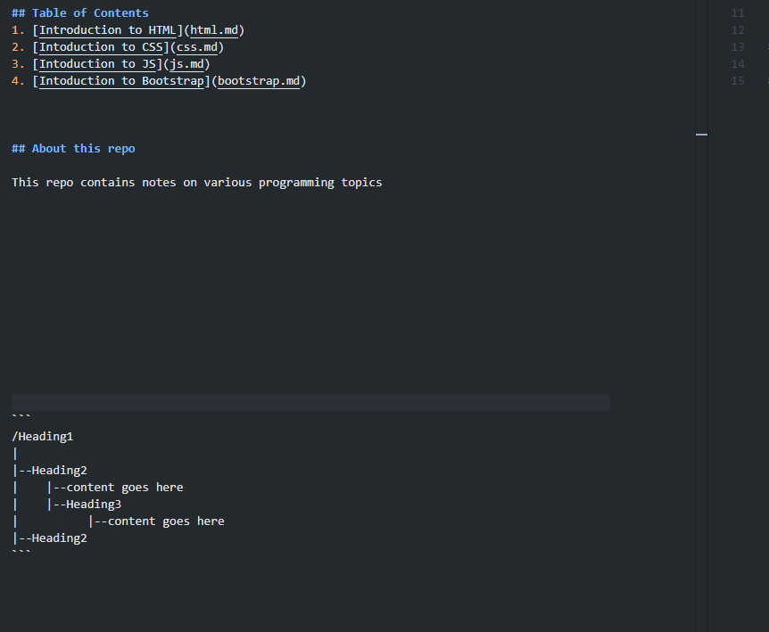

# Notes on HTML

## Elements
An element is made up of an opening tag, a closing tag, and some content
### Opening Tags
Here is an example

```html
<html>
<div class="darkmode">
```

### Closing Tags

### Content